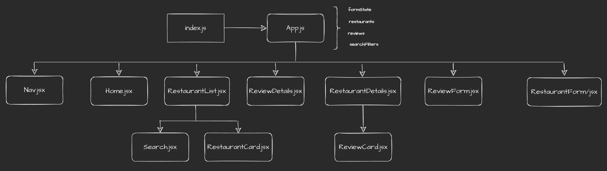

# iRate

## Date: 8/1/2022

### By: Ben Manning, Michael Lackey, a huge group of motivated students
#### [GitHub](https://github.com/SEI-R-6-21)
***

### ***Description***

##### iRate is an application for reviewing restaurants. It was created in two and a half days as part of the SEI-R-6-21 at General Assembly as a group learning project.
***

### ***Technologies Used***

- MongoDB / Mongoose
- Node / Express
- React
***

### ***Getting Started***

##### `Fork` and `Clone` the project and then connect your mongoDB database via a connection string in a `.env` file on the backend.
##### Run `npm run dev` to spin up the backend server. Navigate to the client directory and run `npm start` to spin up the frontend.
##### Or, if you want to get right into it, the project was deployed using Heroku and can be viewed [here]().
***

### ***Screenshots***

  <pre>
    &nbsp;&nbsp;&nbsp;&nbsp;&nbsp;&nbsp;
  </pre>

***

### ***Future Updates***

- [x] ~~Something complete~~
- [ ] Something we haven't done yet
***
