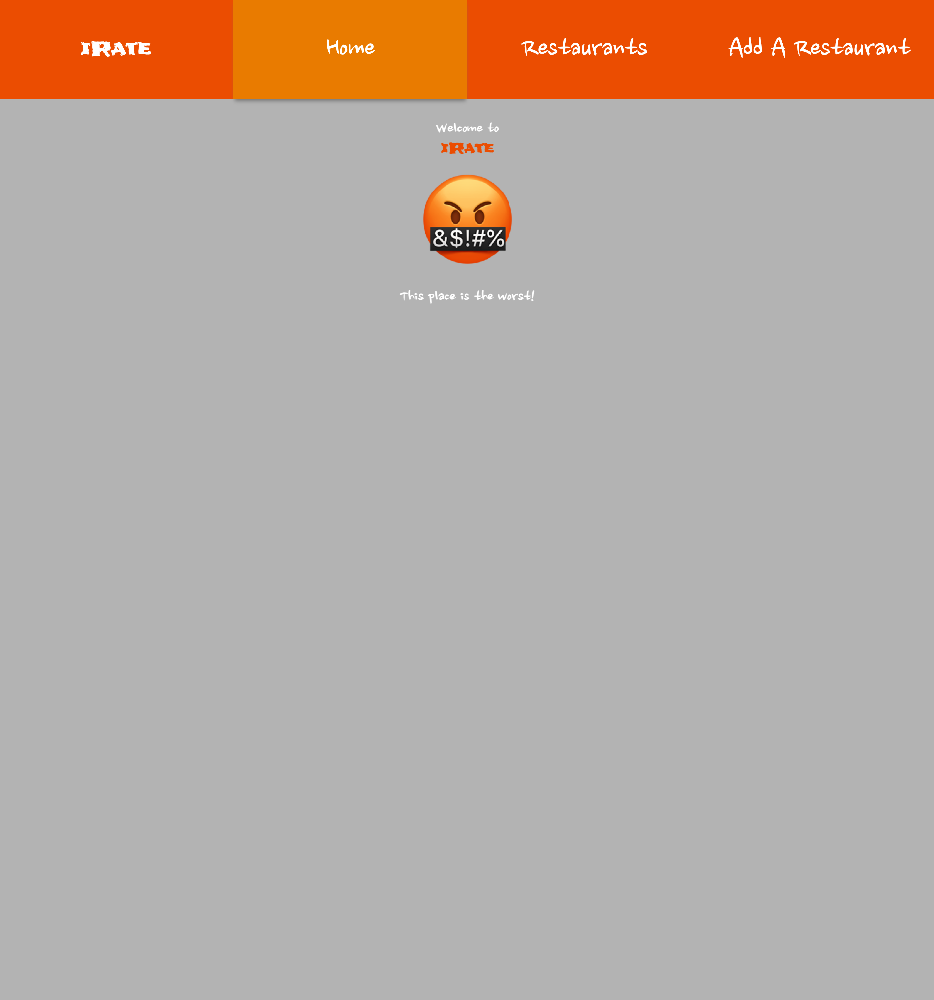
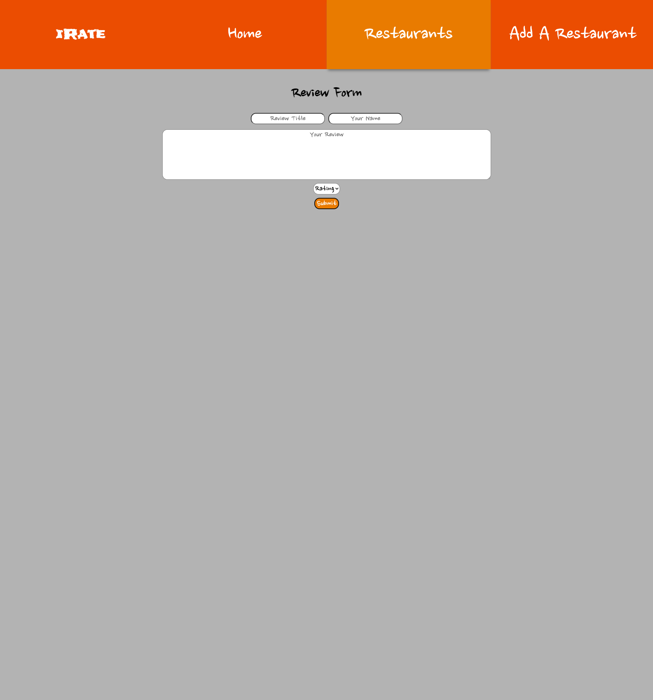

### Date: 6/30/2023

#### By: Michael Lackey

#### [Website](https://michaellackey.com/) | [GitHub](https://github.com/NobodysLackey) | [LinkedIn](https://www.linkedin.com/in/michaelglackey/)
***

### ***Description***

##### A restaurant reviews application to showcase a full stack MERN app to students.

##### The project was deployed and can be viewed [here](https://irate.surge.sh/).

***

### ***Technologies Used***

***

### ***Getting Started***

##### Use the NavBar to navigate throughout the application to see a list of all restaurants. Click on each to see it's details as well as leave a review.

***

### ***Screenshots***

  <pre>
    &nbsp;&nbsp;&nbsp;&nbsp;&nbsp;&nbsp;&nbsp;&nbsp;&nbsp;
  </pre>

***

### ***Future Updates***

- [ ] Deploy backend
- [x] Add a Restaurant
- [x] User Auth
- [ ] Search / filter functionality for restaurants page
- [ ] Pagination for restaurants page
- [ ] Make the app scale for multiple sized screens
- [ ] More fleshed out details page / integrate Google Maps API

***

### ***Credits***

- Express Backend: [Ben Manning](https://github.com/ben-manning)

***
